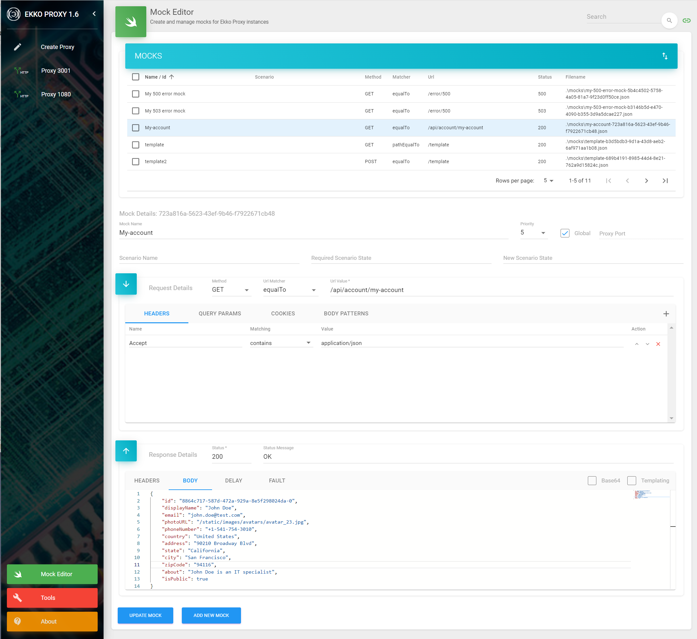

# Ekko Proxy WireMock Editor 1.4
The Ekko Proxy WireMock Editor lets you manage wiremocks for Ekko Proxy instances. Configured mocks are saved to a mocks folder (relative to the application) making them available to Ekko Proxy instances or they can be used by WireMock standalone in JUnits etc.

WireMock Editor Screenshot:

Please see [Ekko Proxy GitHub](https://github.com/lcasoft/ekkoproxy) or [Ekko Proxy Home Page](https://www.ekkoproxy.com) for further details on how to install and use.
